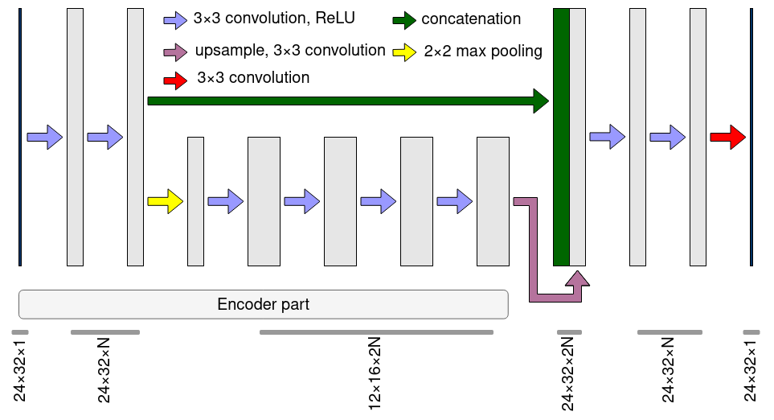
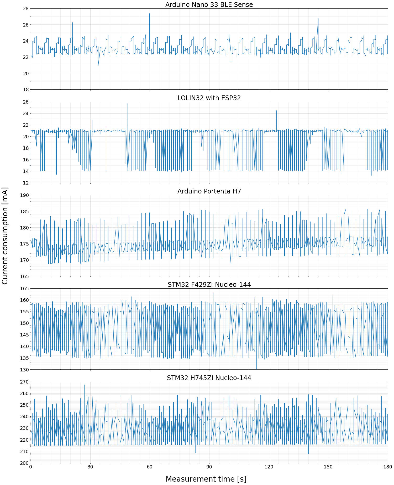

# Hardware Benchmark of Presence Monitoring in Thermal Images

> This is the official repository of the paper: [*Efficient People Counting in Thermal Images: The Benchmark of Resource-Constrained Hardware*](https://ieeexplore.ieee.org/document/9964383).

The repository includes the code for reproducing experiments and obtaining results from the aforementioned publication. This repository is organized as follows:
- [thermo](./thermo/) directory contains code and scripts related to model training, optimization, and quantization phases,
- [evaluation](./evaluation/) folder consists of hardware deployment, inference, and evaluation tools. 


## Table of contents
* [Citation](#citation)
* [Dataset](#dataset)
* [Benchmark Hardware](#benchmark-hardware)
* [Neural Network Architecture](#neural-network-architecture)
* [Results](#results)


## Citation

```
@ARTICLE{9964383,
  author={Piechocki, Mateusz and Kraft, Marek and Pajchrowski, Tomasz and Aszkowski, Przemyslaw and Pieczynski, Dominik},
  journal={IEEE Access}, 
  title={Efficient People Counting in Thermal Images: The Benchmark of Resource-Constrained Hardware}, 
  year={2022},
  volume={10},
  number={},
  pages={124835-124847},
  doi={10.1109/ACCESS.2022.3225233}
}
```

## Dataset

The benchmark utilizes [Thermo Presence](https://github.com/PUTvision/thermo-presence) dataset that consists of 13 644 low-resolution thermal images recorded in office spaces. The dataset distribution is shown in the table below. The training, validation, and test split was chosen according to the authors' choice which is described in their [project repository](https://github.com/PUTvision/thermo-presence/blob/master/dataset/README.md).

<div align="center">

|            |  0  |  1  |   2  |   3  |   4  |  5  | Total |
|:----------:|:---:|:---:|:----:|:----:|:----:|:---:|:-----:|
|  Training  |  99 | 105 | 2984 | 3217 | 1953 | 114 |  8472 |
| Validation |  0  | 139 |  631 | 1691 |  225 | 139 |  2825 |
|    Test    | 162 |  83 |  211 |  341 | 1235 | 315 |  2347 |

</div>


## Benchmark Hardware

<div align="center">

| Device                                                                                         | Target Hardware | Max Clock Frequency | FLASH | SRAM   | Evaluation Framework            |
|------------------------------------------------------------------------------------------------|:---------------:|:-------------------:|:-----:|:------:|:-------------------------------:|
| [Arduino Nano 33 BLE Sense](https://docs.arduino.cc/hardware/nano-33-ble-sense)                        | nRF52840             | 64 MHz  | 1 MB | 256 KB | TFLite Micro                    |
| [Arduino Portenta H7](http://store.arduino.cc/products/portenta-h7)                                    | STM32H747            | 480 MHz | 2 MB | 1 MB   | TFLite Micro                    |
| [LOLIN32](https://www.mischianti.org/2021/02/21/esp32-wemos-lolin32-high-resolution-pinout-and-specs/) | ESP32-WROOM-32       | 240 MHz | 4 MB | 520 KB | TFLite Micro with ESP-NN support|
| [STM32 F429ZI Nucleo-144](https://www.st.com/en/evaluation-tools/nucleo-f429zi.html)                   | STM32F429            | 180 MHz | 2 MB | 256 KB | STM32 Cube AI                   |
| [STM32 H745ZI Nucleo-144](https://www.st.com/en/evaluation-tools/nucleo-h745zi-q.html)                 | STM32H745            | 480 MHz | 2 MB | 1 MB   | STM32 Cube AI                   |
| [Raspberry Pi 4B](https://www.raspberrypi.com/products/raspberry-pi-4-model-b/)                        | Quad Core Cortex-A72 | 1.5 GHz | *    | 2 GB   | TensorFlow Lite                 |
| [Coral USB Accelerator](https://coral.ai/products/accelerator/)                                        | Google Edge TPU      | 500 MHz | *    | 8 MB   | TensorFlow Lite                 |
|[Intel Neural Compute Stick 2](https://ark.intel.com/content/www/us/en/ark/products/140109/intel-neural-compute-stick-2.html)| Intel Movidius Myriad X VPU | 700 MHz | * | 4 GB | OpenVINO |

</div>


## Neural Network Architecture

The neural network is based on U-Net architecture with shallow structure, single-channel input, and output. The proposed model has only 46 577 parameters.

<p align="center">
  
</p>


## Results

### Neural Network Metrics

<div align="center">

| **Metric Name** | MAE    | MSE    | Counting MAE | Counting MSE | Counting MRAPE [%] | Accuracy | F1 Score | No. of parameters |
|:---------------:|:------:|:------:|:------------:|:------------:|:------------------:|:--------:|:--------:|:-----------------:|
| **Results**     | 0.1057 | 0.0332 | 0.0226       | 0.0234       | 0.81               | 0.9778   | 0.9782   | 46 577            |

</div>

### Hardware Performance 

<div align="center">

| Device                                          | Data Type | Avg. Inference Time [ms]  | Counting MAE | Counting MSE | Counting MRAPE [%]  |
|-------------------------------------------------|:---------:|:-------------------------:|:------------:|:------------:|:-------------------:|
| Arduino Nano 33 BLE Sense                       | INT8      | 1430.125 ±1.143           | 0.023        | 0.024        | 0.82                |
| Arduino Portenta H7                             | INT8      |  137.494 ±0.500           | 0.023        | 0.024        | 0.82                |
| LOLIN32                                         | INT8      |  840.442 ±0.021           | 0.023        | 0.023        | 0.81                |
| STM32 F429ZI Nucleo-144                         | INT8      |  230.939 ±0.100           | 0.036        | 0.038        | 1.14                |
| STM32 H745ZI Nucleo-144                         | FP32      |  165.983 ±0.100           | 0.023        | 0.023        | 0.81                |
|                                                 | INT8      |   53.260 ±0.100           | 0.036        | 0.038        | 1.14                |
| Raspberry Pi 4B                                 | FP32      |    7.707 ±0.591           | 0.023        | 0.023        | 0.81                |
|                                                 | FP16      |    7.690 ±0.558           | 0.023        | 0.023        | 0.81                |
|                                                 | INT8      |    4.194 ±0.052           | 0.038        | 0.039        | 1.18                |
| Raspberry Pi 4B + Coral USB Accelerator (std)   | INT8      |    0.605 ±0.044           | 0.037        | 0.038        | 1.16                |
| Raspberry Pi 4B + Coral USB Accelerator (max)   | INT8      |    0.570 ±0.060           | 0.037        | 0.038        | 1.16                |
| Raspberry Pi 4B + Intel Neural Compute Stick 2  | FP32      |    2.630 ±0.159           | 0.028        | 0.029        | 0.92                |
|                                                 | FP16      |    2.300 ±0.100           | 0.028        | 0.029        | 0.91                |

</div>

<p align="center">
  
</p>

The figure above consists of current consumption characteristics measured on benchmarked hardware. The graphs are limited to 180 seconds in order to highlight peaks related to the prediction stage. 
