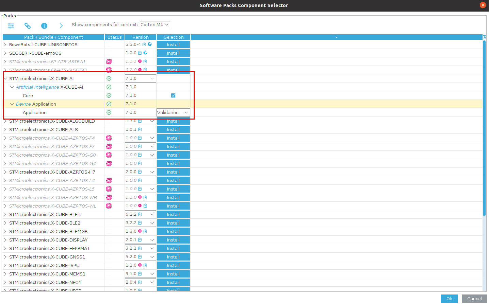
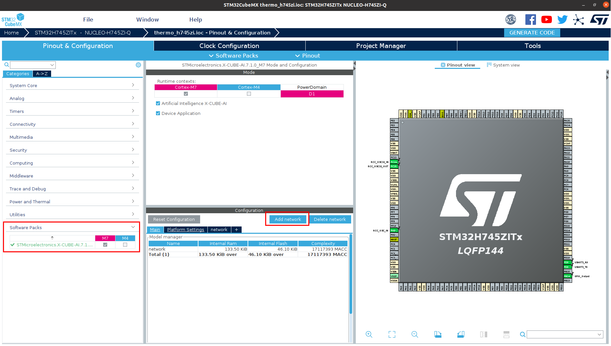
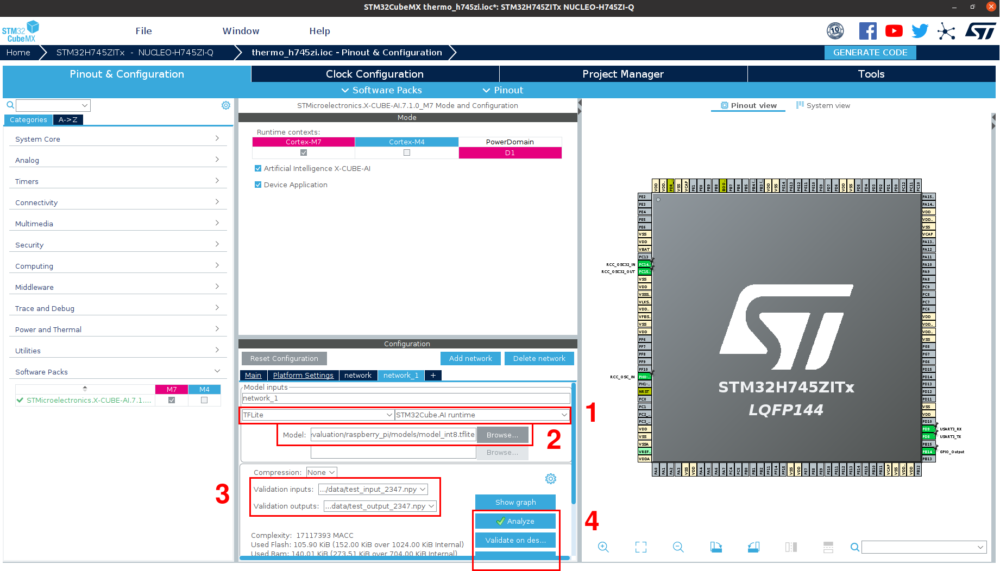
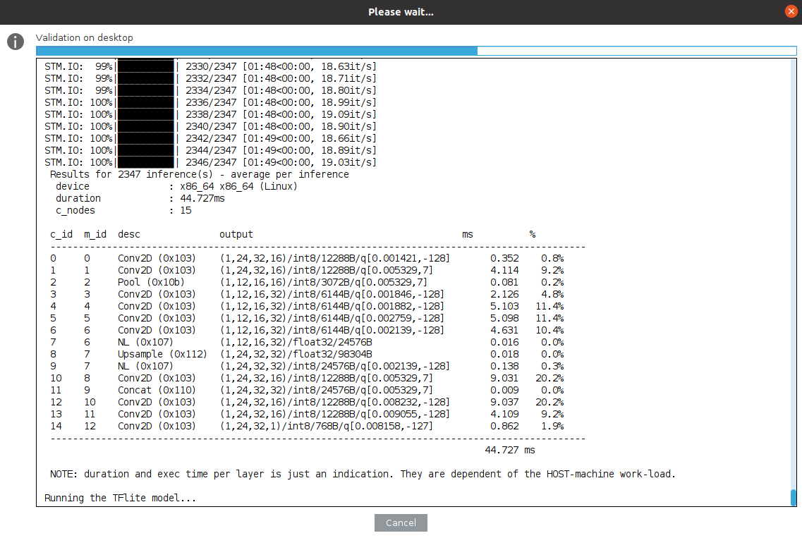

# STM32

This document contains configuration steps, source code, and evaluation of STM32 F429ZI Nucleo-144 and STM32 H745ZI Nucleo-144 platforms to investigate the performance of the proposed neural network model on the Thermo Presence dataset.

## Configuration

1. [STM32CubeMX](https://www.st.com/en/development-tools/stm32cubemx.html) - STM32Cube initialization code generator
2. [X-CUBE-AI](https://www.st.com/en/embedded-software/x-cube-ai.html) - AI expansion pack for STM32CubeMX

  
   
  <b>Fig. 1.</b> X-CUBE-AI package configuration with project

## Configured CubeMX Project Files

- `thermo_f429zi.ioc` - project scheme for STM32 F429ZI Nucleo-144
- `thermo_h745zi.ioc` - project scheme for STM32 H745ZI Nucleo-144

## Evaluation

The neural network model evaluation on STM32 boards was performed using the X-CUBE-AI package and its inference module.

  
   
  <b>Fig. 2.</b> Model adding in X-CUBE-AI package

  
   
  <b>Fig. 3.</b> Configuration of model evaluation in X-CUBE-AI package: 1. Set TFLite framework with STM32Cube AI runtime 2. Select TFLite model 3. Select validation data (from [data](../data/) folder) 4. Select evaluation module, available: analyze, validation on desktop, validation on device

  
   
  <b>Fig. 4.</b> Model evaluation report

